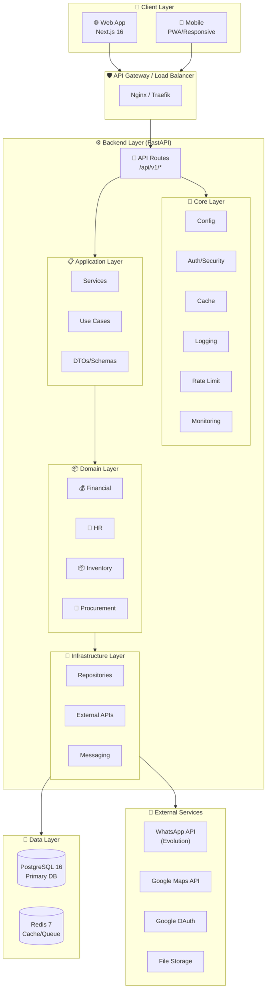
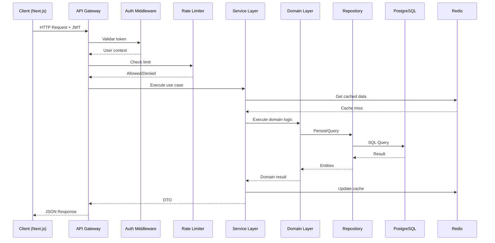
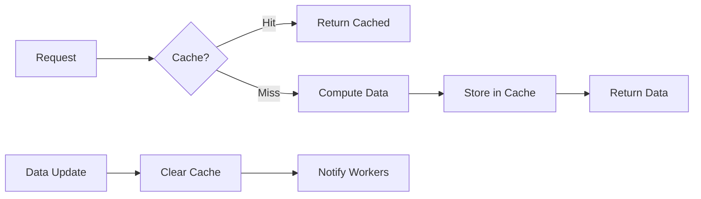
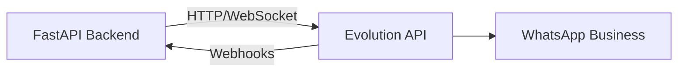
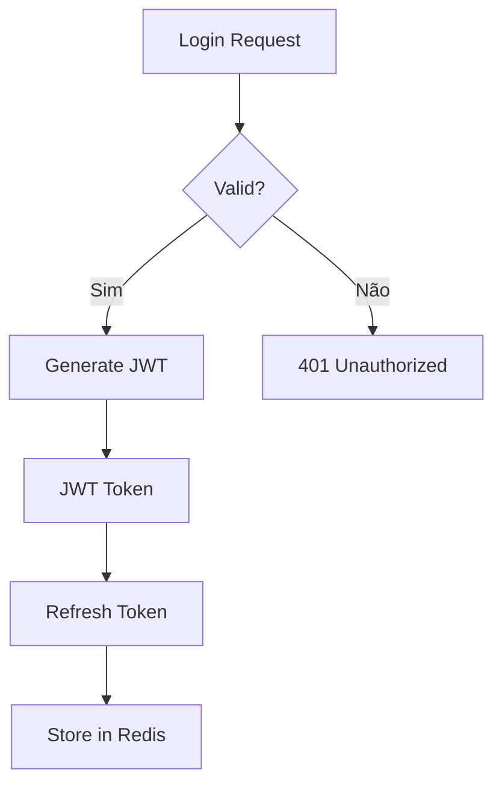
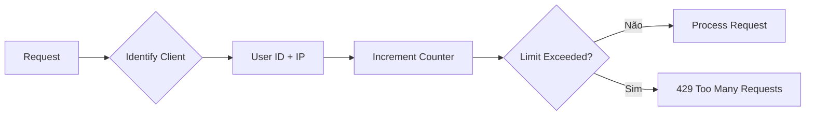
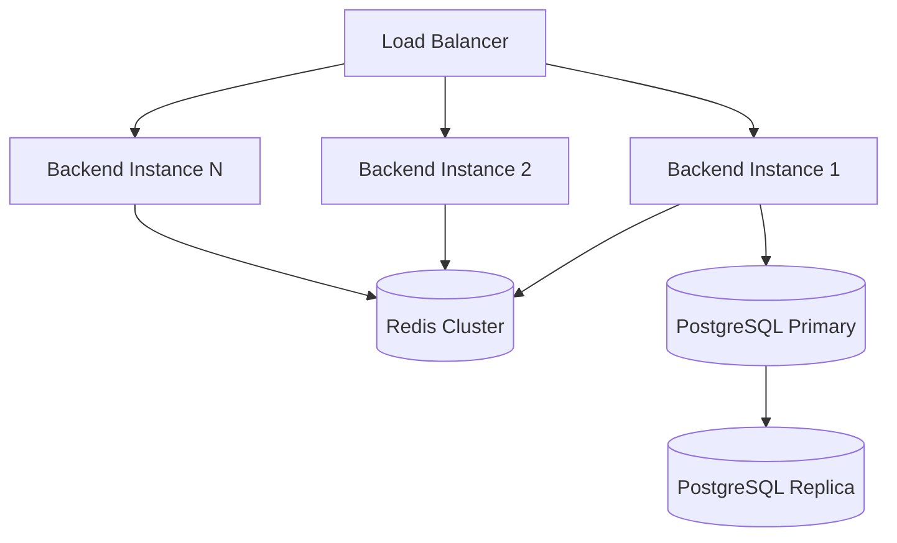
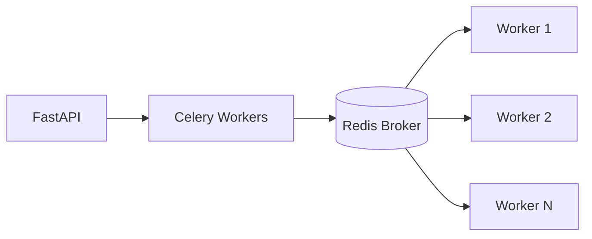

# Arquitetura do Conecta PRO

## Visão Geral

O **Conecta PRO** é um ERP completo desenvolvido com arquitetura moderna, seguindo os princípios da **Clean Architecture** e **Domain-Driven Design (DDD)**. A aplicação é dividida em camadas bem definidas, garantindo separação de responsabilidades, testabilidade e manutenibilidade.



---

## Stack Tecnológica

### Backend

| Camada | Tecnologia | Versão | Propósito |
|--------|-----------|--------|-----------|
| Framework | FastAPI | 0.115.6 | API REST assíncrona |
| Servidor | Uvicorn | 0.34.0 | ASGI server |
| Database | PostgreSQL | 16 | Banco de dados relacional |
| ORM | SQLAlchemy | 2.0.36 | Mapeamento objeto-relacional |
| Migrations | Alembic | 1.14.0 | Controle de versão do schema |
| Cache | Redis | 7 | Cache distribuído e sessions |
| Task Queue | Celery | 5.4.0 | Processamento assíncrono |
| Scheduler | APScheduler | 3.10.4 | Agendamento de tarefas |
| Auth | python-jose + passlib | 3.3.0 / 1.7.4 | JWT e hashing de senhas |
| 2FA | pyotp | 2.9.0 | Autenticação de dois fatores |
| Validation | Pydantic | 2.10.4 | Validação de dados |
| Rate Limiting | slowapi | - | Limitação de requisições |

### Frontend

| Camada | Tecnologia | Versão | Propósito |
|--------|-----------|--------|-----------|
| Framework | Next.js | 16 | React framework com SSR/SSG |
| Language | TypeScript | 5.x | Tipagem estática |
| Styling | Tailwind CSS | 3.x | Utility-first CSS |
| Components | Radix UI | - | Componentes acessíveis |
| Icons | Lucide React | - | Biblioteca de ícones |
| Charts | Recharts | - | Visualização de dados |
| Dates | date-fns | - | Manipulação de datas |
| HTTP Client | Axios / Fetch | - | Comunicação com API |

### DevOps & Infraestrutura

| Ferramenta | Propósito |
|------------|-----------|
| Docker | Containerização |
| Docker Compose | Orquestração local |
| Nginx | Reverse proxy e static files |
| GitHub Actions | CI/CD |
| Let's Encrypt | SSL/TLS certificates |

---

## Camadas da Aplicação (Clean Architecture)

### 1. Core Layer (`/backend/core/`)

Camada transversal contendo configurações e utilitários compartilhados:

```
core/
├── config/           # Configurações da aplicação
├── auth/             # Autenticação e autorização
├── cache/            # Gerenciamento de cache Redis
├── database/         # Conexão e sessões do banco
├── exceptions/       # Exceções customizadas
├── logging/          # Configuração de logging estruturado
├── monitoring/       # Métricas e health checks
├── rate_limit.py     # Limitação de requisições
├── security/         # Segurança (headers, CORS, etc.)
├── models/           # Modelos base
└── schemas/          # Schemas Pydantic base
```

**Responsabilidades:**
- Configuração centralizada via `pydantic-settings`
- Logging estruturado com correlação de requests
- Middleware de segurança (CSP, HSTS, CORS, GZip)
- Rate limiting distribuído com Redis
- Cache com TTL e invalidação

### 2. API Layer (`/backend/api/v1/`)

Controllers e routes da API REST:

```
api/v1/
├── routes/           # Definição de rotas
├── dependencies/     # Injeção de dependências
└── middlewares/      # Middlewares específicos
```

**Responsabilidades:**
- Recebimento e validação de requests HTTP
- Autenticação via JWT/OAuth2
- Rate limiting por endpoint
- Serialização de respostas

### 3. Application Layer (`/backend/application/`)

Orquestração de casos de uso:

```
application/
├── services/         # Serviços de aplicação
├── use_cases/        # Casos de uso do negócio
├── dto/              # Data Transfer Objects
└── interfaces/       # Interfaces para infraestrutura
```

**Responsabilidades:**
- Implementação da lógica de aplicação
- Orquestração de domínios
- Validação de regras de negócio
- Transações distribuídas

### 4. Domain Layer (`/backend/domains/`)

Regras de negócio puras, divididas por contextos delimitados:

```
domains/
├── financial/        # Financeiro (contas, faturamento)
├── hr/               # Recursos Humanos
├── inventory/        # Estoque e patrimônio
└── procurement/      # Compras e licitações
```

Cada domínio contém:
```
domain/
├── models/           # Entidades de domínio
├── repositories/     # Interfaces de repositório
├── services/         # Serviços de domínio
├── events/           # Eventos de domínio
└── value_objects/    # Objetos de valor
```

**Responsabilidades:**
- Entidades e objetos de valor
- Regras de negócio invariáveis
- Eventos de domínio
- Interfaces de repositório (ports)

### 5. Infrastructure Layer (`/backend/infrastructure/`)

Implementações concretas de interfaces:

```
infrastructure/
├── repositories/     # Implementações SQLAlchemy
├── external/         # Integrações com APIs externas
├── messaging/        # Fila de mensagens (Celery)
├── persistence/      # Acesso a dados
└── notifications/    # Email, SMS, WhatsApp
```

**Responsabilidades:**
- Acesso ao banco de dados
- Integrações com APIs externas
- Envio de notificações
- Processamento de filas

---

## Fluxo de Dados



### Cache Strategy



**Políticas de Cache:**
- **TTL Padrão:** 5 minutos para dados frequentes
- **Cache Warming:** Pré-carregamento em horários específicos
- **Invalidação:** Por eventos de domínio (write-through)
- **Cache Keys:** Namespace por tenant + recurso + ID

---

## Serviços Externos Integrados

### 1. WhatsApp API (Evolution API)



**Uso:**
- Notificações automáticas para clientes
- Confirmação de agendamentos
- Alertas de vencimento
- Comunicação com diaristas

**Configuração:**
```env
WHATSAPP_API_ENABLED=true
EVOLUTION_API_URL=https://evo.conectamais.pro
EVOLUTION_API_KEY=***
WHATSAPP_INSTANCE_ID=conecta-pro
```

### 2. Google Maps API

**Uso:**
- Geocoding de endereços
- Cálculo de rotas otimizadas
- Visualização de mapas no frontend
- Agrupamento de pontos (clustering)

**Configuração:**
```env
GOOGLE_MAPS_ENABLED=true
GOOGLE_MAPS_API_KEY=***
MAPS_DEFAULT_CENTER_LAT=-23.5505
MAPS_DEFAULT_CENTER_LNG=-46.6333
```

### 3. Google OAuth 2.0

**Uso:**
- Autenticação SSO
- Integração com Google Workspace
- Acesso a Google Calendar

**Configuração:**
```env
GOOGLE_CLIENT_ID=***
GOOGLE_CLIENT_SECRET=***
GOOGLE_REDIRECT_URI=https://erp.conectamais.pro/api/v1/auth/google/callback
```

### 4. File Storage

**Uso:**
- Armazenamento de documentos (GED)
- Upload de comprovantes
- Exportação de relatórios

**Implementações:**
- Local (desenvolvimento)
- AWS S3 (produção)
- MinIO (self-hosted)

---

## Estrutura do Projeto

```
conecta-pro/
├── backend/
│   ├── main.py                 # Entry point FastAPI
│   ├── core/                   # Camada transversal
│   ├── api/v1/                 # Controllers/Routes
│   ├── application/            # Casos de uso
│   ├── domains/                # Domínios do negócio
│   ├── infrastructure/         # Implementações
│   ├── modules/                # Módulos auxiliares
│   ├── alembic/                # Migrations
│   ├── tests/                  # Testes
│   ├── requirements.txt        # Dependências Python
│   └── Dockerfile              # Container backend
│
├── frontend/
│   ├── src/
│   │   ├── app/                # Rotas Next.js (App Router)
│   │   ├── components/         # Componentes React
│   │   ├── features/           # Módulos por feature
│   │   ├── hooks/              # Custom hooks
│   │   ├── lib/                # Utilitários
│   │   ├── services/           # API clients
│   │   ├── types/              # TypeScript types
│   │   └── styles/             # CSS/Tailwind
│   ├── next.config.ts          # Config Next.js
│   ├── package.json            # Dependências Node
│   └── Dockerfile              # Container frontend
│
├── docker-compose.yml          # Orquestração local
├── docs/                       # Documentação
└── scripts/                    # Scripts utilitários
```

---

## Segurança

### Headers de Segurança

```python
# Implementados via SecurityHeadersMiddleware
X-Content-Type-Options: nosniff
X-Frame-Options: DENY
X-XSS-Protection: 1; mode=block
Referrer-Policy: strict-origin-when-cross-origin
Content-Security-Policy: default-src 'self'; ...
Strict-Transport-Security: max-age=31536000; includeSubDomains
```

### Autenticação



### Rate Limiting



**Limites:**
- API Geral: 1000 requests/hora
- Auth: 10 requests/minuto
- Webhooks: 100 requests/minuto

---

## Escalabilidade

### Horizontal Scaling



### Processamento Assíncrono



---

## Monitoramento

### Métricas

- **Application:** Request count, latency, error rate
- **Business:** Usuários ativos, transações/minuto
- **Infrastructure:** CPU, memory, disk I/O
- **External:** API response times, error rates

### Logging

```json
{
  "timestamp": "2025-01-01T12:00:00Z",
  "level": "INFO",
  "request_id": "uuid",
  "user_id": "123",
  "method": "GET",
  "path": "/api/v1/clients",
  "status_code": 200,
  "duration_ms": 45,
  "message": "Request completed"
}
```

---

## Versionamento

A API segue versionamento semântico na URL:

```
/api/v1/    # Versão atual estável
/api/v2/    # Futura versão (em desenvolvimento)
```

**Política de deprecação:**
- Versões suportadas por 12 meses após release da próxima versão
- Headers de sunset em respostas
- Documentação de breaking changes

---

## Referências

- [FastAPI Documentation](https://fastapi.tiangolo.com/)
- [Clean Architecture - Robert C. Martin](https://blog.cleancoder.com/uncle-bob/2012/08/13/the-clean-architecture.html)
- [Domain-Driven Design - Eric Evans](https://domainlanguage.com/ddd/)
- [Next.js Documentation](https://nextjs.org/docs)
- [Docker Best Practices](https://docs.docker.com/develop/dev-best-practices/)
